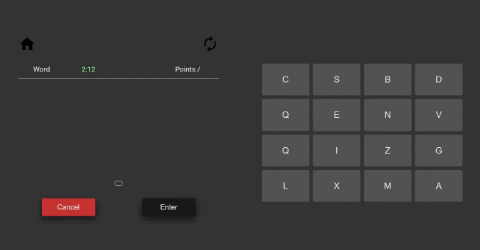
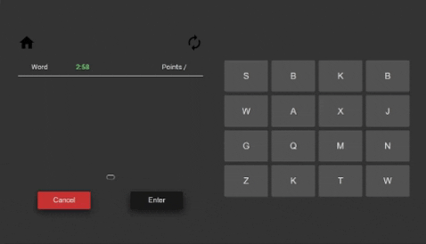

# WordMatch

### First of all game is based on:

-  [Wordshake](https://learnenglish.britishcouncil.org/general-english/games/wordshake) by BritishCoucil
-  [Słowotok](https://play.google.com/store/apps/details?id=pl.slowotok.app&hl=en) by SpringLabs

### For word matching I use

-  [Datamuse API](https://www.datamuse.com/api/)

### About gameplay

Game starts on the board which has 16 fields and each field has its letter.

Your job is to find as many english words as possible with these letters.



## How to play

### If you have node you can do it locally with

```
npm start
```

### Or just go there

-  [WordMatch](https://glazinski.github.io/word-match/)

## Game rules

-  Your word has to be longer than 2 characters;
-  You can't enter the same word twice;
-  Pattern for points: (Length of the word \* 2) - 4;
-  You've got 3 minutes before game ends;

## Controls

-  **Spacebar** - activates kaymap



-  **Enter** - submits your word
